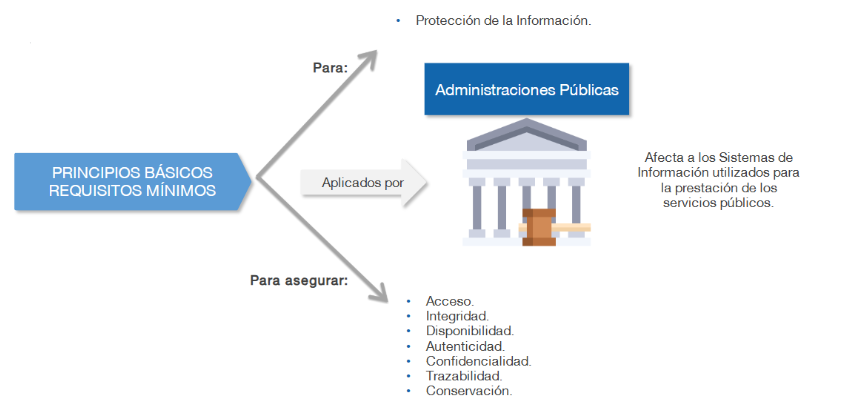
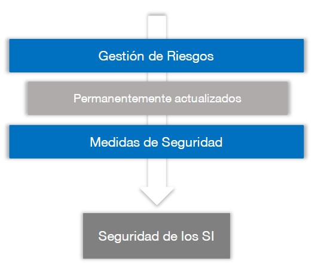
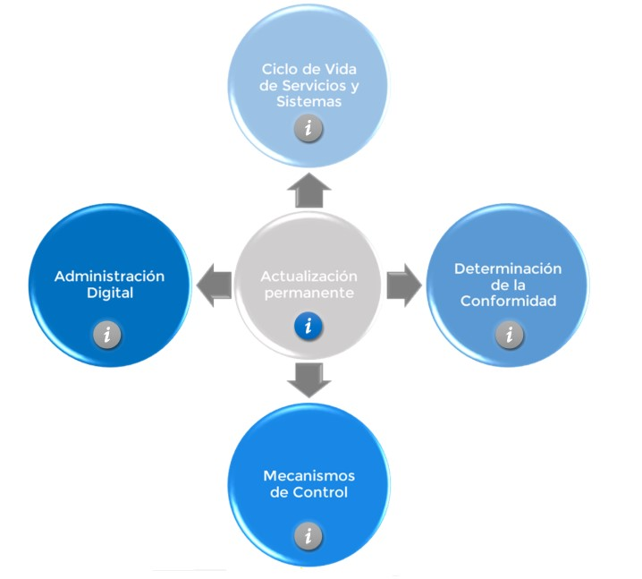

# Esquema nacional de seguridad (ENS)

    

        
    

    

        
<strong>Curso:</strong> Esquema nacional de seguridad (ENS) 
        <strong>Plataforma:</strong> Ángeles - (CCN-CERT) 
        <strong>Fecha:</strong> 07 Mar 2025 
        <strong>Tiempo:</strong> 20 horas.

    

> Este documento recoge mis notas del curso "Esquema nacional de seguridad (ENS)" realizado en la plataforma Ángeles del Centro Criptológico Nacional (CCN-CERT). Este curso forma parte del programa de formación en ciberseguridad ofrecido por el CCN para profesionales del sector público y privado.

## 1. La Administración Electrónica y la Seguridad de la Información

La Constitución española de 1978 proclama, en su artículo 103.1, que: "La Administración Pública sirve con objetividad los intereses generales y actúa de acuerdo con los principios de eficacia, jerarquía, descentralización, desconcentración y coordinación, sometimiento pleno a la Ley y al Derecho.

### 1.1. El origen. Marco jurídico y normativo

La Ley 11/2007 de Acceso Electrónico de los Ciudadanos a los Servicios Públicos fue el inicio de la Administración electrónica en España, buscando mejorar la eficacia y eficiencia en los servicios públicos. Esta ley fue derogada, pero dio paso a la Ley 40/2015 y la Ley 39/2015, que consolidaron y desarrollaron la administración digital y los procedimientos administrativos.

### 1.2. Introducción al Esquema Nacional de Seguridad

Tiene por objetivo establecer **políticas de seguridad en la utilización de medios electrónicos** y esta constituido por los principios básicos y requisitos mínimos para garantizar la seguridad de la información tratada.

El uso eficiente de las TIC permite a los ciudadanos ver a la Administración como una entidad a su servicio, posibilitando una mejor integración y accesibilidad de empresas, ciudadanos y profesionales.

## 2. Introdución al ENS

- **Sistema de Información (SI):** Conjunto organizado de recursospara que la información pueda ser manejada y soportar los servicios prestados con ciudadanos, profesionales, empresas. Lo constituyen:
- **Sistema de Gestión de la Seguridad de la Información (SGSI):** Aplicado sobre un SI garantiza la seguridad en la prestación de servicios y en la custodia de la información que estos requieren tratar.
- **SI interconectados:** Los SI suelen estar **interconectados** con otros sistemas pertenecientes al sector privado, ciudadanos, profesionales, empresas. Esto supone una coordinación para evitar "tierras de nadie" o fracturas pudiendo dañar la información, por eso surge la necesidad de **seguridad de la información** (**ciberseguridad**).
 
### 2.1. ENS: Principios básicos y requisitos mínimos.

El ENS está construido por **principios básicos y requisitos mínimos:**

<figure markdown="span">
    { width="600" }
    <figcaption>Principios básicos y requisitos mínimos</figcaption>
</figure>

- **Principios básicos:** Fundamentos que deben regir toda acción orientada a la protección la información y los servicios.
    - **La seguridad de un SI:** La seguridad en el ENS es un proceso integral constituido por elementos humanos, materiales, técnicos, jurídicos, organizativos, relacionados con el sistema.
        - **Concienciación y formación:** Para dotar los SI de la seguridad adecuada es necesaria una concienciación y formación de todas aquellas personas que interveienen en los procesos y sus responsabilidades jerárquicas.
    - **<u>Gestión de riesgos:</u>** Consiste en un **proceso recurrente, continuo y de permanentemente actualización** permitiendo el mantenimiento de un entorno controlado y permitiendo la aplicación de **medidas de seguridad** de manera equilibrada.
        - **<u>Permanentemente actualizados (Riesgos)</u>**
            - Identificación: Identifica los activos relevantes del sistemas y amenezas que podrían afectarlos.
            - Análisis: Consiste en la determinación del valor de riesgo a partir de la probabilidad de que la amenaza se materialice.
            - Evaluación: Se define un humbral de riesgo aceptable (apetito de riesgo).
            - Tratamiento: Planificar, implementar y controlar las acciones determinadas para tratar los riesgos.
        - **<u>Medidas de Seguridad</u>**
            - Prevención: Medidas que tienen como objetivo disuadir o reducir la posibilidad de que las amenazas lleguen a materializarse.
            - Detección: Medidas dirigidas al descubrimiento de un ciberdelicuente.
            - Respuesta: Mediedas orientadas a la restauración de la información y servicios que puedan verse afectados.
            - Conservación: El sistema garantizará la conservación de los datos e información en soporte electrónico.
            - **Incidentes de seguridad**
                -  Gestión de incidentes: Procedimientos seguidos para detectar, analizar y limitar un incidente.
                - Incidente de seguridad: Suceso inesperado o no deseado en consecuencia con consecuencias negativas.

    <figure markdown="span">
        { width="300" }
        <figcaption>Seguridad de los Sistemas de Información</figcaption>
    </figure>

    - **Política de seguridad:** Conjunto de directrices establecidos de acuerdo con los **principios básicos** y se desarollará aplicando los **requisitos mínimos** que rigen la forma en que una organización gestiona y protege la información.
    - **Vigilancia continua:** Permite la **evaluación permanente** del estado de seguridad de los activos. Las medidas de seguridad se **reevaluarán y actualizarán periodeicamente** reduciendo así la superficie de exposición.
        - **Activo:** Componente o funcionanlidad software o hardware de un SI susceptible de ser atacado.
        - **Monitorización continua:** Proceso dinámico basado en el seguimiento de indicadores críticos de seguridad y parcheo de vulnerabilidades.
  
- **Requisitos mínimos:** Se exigen en proporción a los riesgos identificados.
    - Acceso: Protección de las instalaciones mediante acceso controlado y debidamente autorizado.
        - **Minímo privilegio**: El sistema proporcionará la funcionalidad exclusivamente imprescindible.
    - Integridad: Se adoptarán mecanismos para proteger la información contra modificaciones no autorizadas o corrupción de datos.
    - Disponibilidad: Los sistemas dispondrán de copias de seguridad para garantizar la continuidad de las operaciones.
    - Autenticidad: Se aplicarán controles para verificar la identidad de los usuarios, procesos y sistemas.
    - Confidencialidad: Se protegerá la información contra accesos no autorizados.
    - Trazabilidad: Medidas de seguridad que garantizan la observancia y registro de actividad.
        - Se registrarán las actividades de los usuarios.
        - Se analizarán las comunicaciones entrantes o salientes.
        - Cada usuario que accede al sistema será identificado de forma única.
    - Conservación: Se prestará atención a la información a lo largo de su ciclo de vida **almacenada o en tránsito.**

### 2.2. Diferenciación de responsabilidades

- **Organización de la Seguridad:** Está organización debe determinar precisión los diferentes actores, sus funciones y responsabilidades. 
    - **La política de seguridad** detallará las atribuciones de cada responsable y los mecanismos de coordinación y resolución de conflictos.
    - **Existencia de líneas de defensa:** Múltiples capas de seguridad con medidas de naturaleza organizativa, física y lógica.
- Distinguiremos entre comités y roles:
    - **<u>Niveles de Roles</u>**
        - **Nivel de gobierno**: Se centra en la dirección y control de la organización para alcanzar los objetivos. 
            - Dirección de la entidad: Responsable de fijar los objetivos estratégicos, sus relaciones y actividades incluyendo la aprobación de las **políticas de seguridad y de protección de datos**.
            - Responsable de la información: Establece los requisitos de la información en materia de seguridad.
            - Responsable del servicio: Determina los niveles de seguridad de la información 
        - **Nivel de supervisión**: Se centra supervsión de la seguridad de la información y la ciberseguridad en la prestación de los servicios.
            - Responsable de seguridad: Determinar las decisiones para satisfacer los requisitos de seguridad, promover las auditorías, promover la formación y conciliación, supervisar la implementación, monitorizar el sistema...
            - Delegado de protección de datos: Informa o asesora al responsable dle tratamiento, supervisa el cumplimiento de lo dispuesto en el RGPD, ofrece asesoramiento.
        - **Nivel operativo**: Centradao en la parte operacional del SI, como soporte de los diferentes servicios e información manejada.
            - Responsable del sistema (RSIS): Desarrollar, operar y mantener el sistema durante todo su ciclo de vida. Esta responsabilidad no puede recaer en la misma persona que cumple con el rol de responsable de seguridad.
            - Administrador de seguridad del sistema (ASS): Dirigen las funciones de seguridad de una organización, entre ellas la seguridad física y la seguridad de los empleados y las instalaciones.
    - **<u>Comités para la gestión y coordinación de la seguridad</u>**
        - Comité de seguridad: Se responsabiliza de alinear las actividades de la organización en materia de seguridad de la información
        - Comité de trabajo técnico: Más dinámico para el seguimiento con mayor periocidad (grandes empresas).
        - comité de seguridad corporativa: se responsabiliza de alinear todas las actividades en materia de seguridad patrimonial (seguridad de las instalaciones) y planes de contingencia. 

### 2.3. Normas jurídicas presentes en el ENS

- Reglamento (UE) 910/2014, (eIDAS). Ley 6/2020 reguladora de determinados aspectos de los servicios electrónicos de confianza.
- Directiva (UE) 2016/1148, conocida como "Directiva NIS".
- Real Decreto-ley 12/2018, de 7 de septiembre, de seguridad de las redes y sistemas de información (transposición de la Directiva NIS).
- Real Decreto 43/2021, de 26 de enero, desarrollo de la transposición de la Directiva NIS.
- Reglamento (UE) 2016/679, del Parlamento Europeo y del Consejo, de 27 de abril de 2016 (RGPD).
- Ley Orgánica 3/2018, de 5 de diciembre, de Protección de Datos Personales y garantía de los derechos digitales (LOPD-GDD). Estrategia Nacional de Ciberseguridad, publicada en 2019.

## 3. Infraestructuras y Servicios Comunes

- El RD del ENS se desarrolla mediante: 
    - Instrucciones técnicas de seguridad (ITS): Instrucciones de obligado cumplimiento que tendrán en cuenta las normas armonizadas por la UE.
    - Guías CCN-STIC: Guías para mejorar el cumplimiento de los establecido.

### 3.1. Perfiles de cumplimiento
En virtud al **principio de proporcionalidad** y buscando una eficiente aplicación del ENS a determinadas entidades o sectores de actividad concretos. 

Se podrán implementar perfiles de cumplimiento específicos que comprenderán aquel **conjunto de medidas de seguridad** que resultan **idóneas para una concreta categoría de seguridad**. El CCN validará y pulicará los corresponidentes perfiles de cumplimiento específicos que se definen.

Ejemplos de algunos perfiles:

- CCN-STIC 883C Ayuntamientos entre 75.000 y 20.000 habitantes.
- CCN-STIC 883B Ayuntamientos de menos de 20.000 habitantes.
- CCN-STIC 885 Servicio de Cloud Corporativo Office 365.
- CCN-STIC 886 Sistema Cloud Privados y Comunitarios.

### 3.2. Comunicaciones electrónicas
El ENS persigue el establecimiento de las condiciones técnicas de seguridad de las comunicaciones electrónicas, en lo relativo a constancia de:

- La transmisión y recepción.
- La fecha y hora de la puesta a disposición
- El contenido integro de tales comunicaciones.
- La identificación del reminente y destinatario de las mismas.

## 4. Auditorías de Seguridad y Respuesta a Incidentes

Auditoría de seguridad: Proceso sistemático, independiente y documentado que persigue la obtención de evidencias objetivas y su evaluación objetiva para determinar en qué medida se cumplen los criterios de auditoría en relación con la ideoniedad de los controles de seguridad adoptados, el cumplimiento de la política de seguridad, las normas y los procedimientos operativos establecidos, y detectando desviaciones a los antidichos criterios.

### 4.1. Auditorías de Seguridad

- Necesidad: Como la seguridad es un proceso continuo, es necesario que de manera periódica, se revise el estado de seguridad de los SI.
    - Los SI afectados por el ENS serán objetivo de una auditoría ordinaria al menos cada dos años.
    - Los SI afectados por el ENS serán objetivo de una auditoría extreaordinaria siempre que se produzcan modificaciones sustanciales.
    - La auditoría se realizará en función de la categoría del sistema.
    - Se utilizarán críterios y métodos de trabajo nacional e internacional.
- Objeto de la auditoría
    - Emitir una opinión independiente y objetiva sobre el cumplimiento de los requisitos establecidos.
    - El objetivo final es sustentar la confianza que merece el sistema auditado en materia de seguridad, es decir, garantizar la integridad disponibilidad, autenticidad, confidencialidad y trazabilidad.
- Metodología
    - Identificar el alcance y objetivs de la auditoría.
    - Los recursos necesarios y apropiados para realizar la auditoría.
    - La evaluación de los resultados individuales y globales.
    - La emisión formal del Informe de auditoría.
- Informe
    - Debe dictaminar el grado de cumplimiento del ENS, identificar sus deficiencias y sugerir las posibles medidas correctoras.
- Equipo auditor
    - Este equipo podrá estar formado por auditores internos y externos o una combinación de ambos.

### 4.2. Informe del estado de la seguridad (INES)

INES: Permite evaluar regularmente el estado de la seguridad de los sistemas TIC de las entidades pertenecientes al sector público. Los actores relevantes son: 
- Comisión sectorial de administración electrónica: Recoge la información relacionada con el estado de las principales variables de la seguridad en los sistemas de información.
- CCN: Articulará los procedimientos necesarios para la recogida y consolidación de la información, así como la respuesta a los incidentes de seguridad. Tras un incidente el **CCN-CERT** (CCN Computer Emergency Response Team):
    - Asume la función de coordinación nacional.
    - Articula la respuesta a los incidentes de seguridad.
    - Sin perjuicio de la capacidad de cada AP.
- Autoridades competentes: Impulsan las medidas oportunas que facilitan la mejora continua del estado de la seguridad utilizando es su caso, cuadro de mando e indicadores que contribuyen a la toma de decisiones mediante el uso de herramientas CCN.

### 4.3. Normas de Conformidad y actualización del ENS

<figure markdown="span">
    { width="500" }
    <figcaption>Normas de Conformidad y actualización del ENS</figcaption>
</figure>

- Actualización permanente: El ENS se mantendrá actualizado de manera permanente a lo largo del tiempo.
- Ciclo de vida de los Servicios del Sistema: Las especificaciones de seguridad se incorporaran a los ciclos de vida de los servicios.
- Determinación de la Conformidad: Los sistemas precisarán de una autoría para la certificación de su conformidad.
- Mecanismo de Control: Cada entidad titular de SI establecerán sus mecanismos de control para garantizar el cumplimiento del ENS.
- Administración Digital: El CCN es el órgano competente para agrantizar la debida interoperabilidad en materia de ciberseguridad y criptografía.

### 4.4. Categorización de los SI

Está categorización se efectuará en función de:
- **Valoración del impacto:** Principales pilares de la seguridad (Tríada CIA).
- **Valoración de las consecuencias:** 
    - La capacidad de la organización para lograr sus objetivos.
    - Proteger sus activos.
    - El cumplimiento de sus obligaciones de servicios.

## 5. Órganos y Organismos de referencia
El diseño y la implementación de Sistemas de Gestión de Información requiere de una formación adecuada de los profesionales. El CCN (Centro Criptológico Nacional) y el Instituto Nacional de Administración Pública (INAP) desarrollaran programas concienciliación y formación.

El principal objetivo del CCN es contribuir a la mejora del nivel de seguridad de los sistemas de todo el sector público en España a través de cuatro grandes líneas de actuación:
- Soporte de la coordinación para la resolución de incidentes.
- Investigación y divulgación de mejores prácticas.
- Formación y conciliación a través de cursos.
- Alerta y avisos de nuevas amenazas y vulnerabilidades.

**Organismos de referencia**
Las organizaciones del sector privado que presten servicios a las entidades públicas notificarán al INCIBE-CERT (Instituto Nacional de Ciberseguridad) 

**<u>Plan de Adecuación al ENS</u>**
- Plítica de Seguridad.
- Información que se maneja, con su valoración.
- Servicios que se prestan, con su valoración.
- Datos de carácter personal.
- Categoría del sistema.
- Análisis de riesgos.
- Declaración de aplicabilidad de las medidas de seguridad.
- Insuficiencias del sistema.
- Plan de mejora de seguridad, incluyendo plazos de ejecución.
