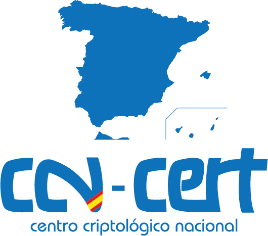

# Certificados Digitales

**Curso:** Certificados Digitales  
**Plataforma:** Ángeles - (CCN-CERT)  
**Fecha:** 02 Mar 2025 - 04 Mar 2025  
**Tiempo:** 15 horas.

> Este documento recoge mis notas del curso "Certificados Digitales" realizado en la plataforma Ángeles del Centro Criptológico Nacional (CCN-CERT). Este curso forma parte del programa de formación en ciberseguridad ofrecido por el CCN para profesionales del sector público y privado.